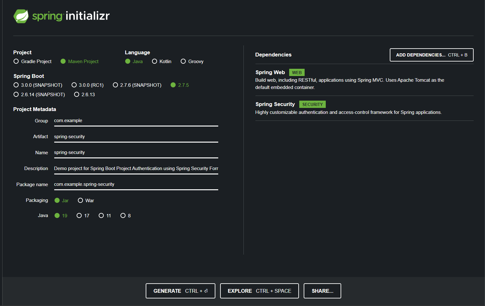
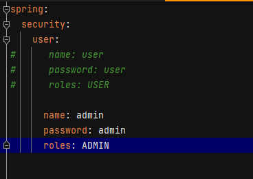
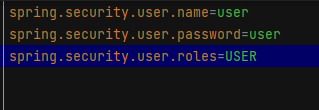

# Spring-Security
It is a project for implementing spring security authentication

# Create a New Spring Boot Project

-> To create a new project many ways

[Using Spring Initializer](https://start.spring.io)

    * we can create a project using spring initializer website
    * Using IDE's like Spring Tool Suite(STS), Intellij IDEA.

### Using Spring Initializer

### Project Setup

-> Create a Resource Class (REST Endpoints to expose)

-> Create an Application Security Class to configure the Security

Note: By default when we launch the spring security application it will show the password in console.

To Login, we need to provide the user details:
    username : user
    password : Generated in Spring Output Console

*** We can modify the username & password by changing application.properties/yaml/yml file.

Note: We can use each property only once. Duplicate will be not allowed.

**Application.yaml/yml file**

**Application.properties file**

** Note: If we have the application.properties and application.yaml files then spring boot application only 
considers the application.properties as default....